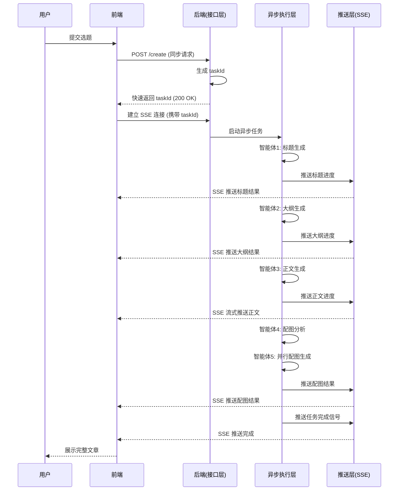
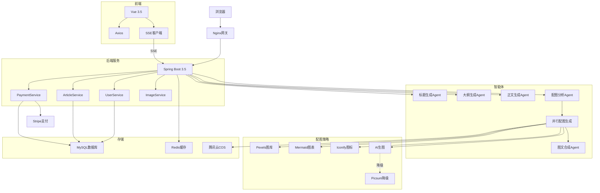
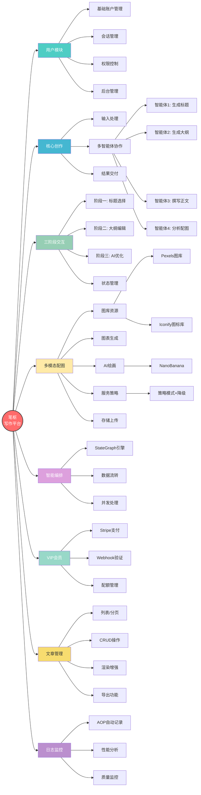
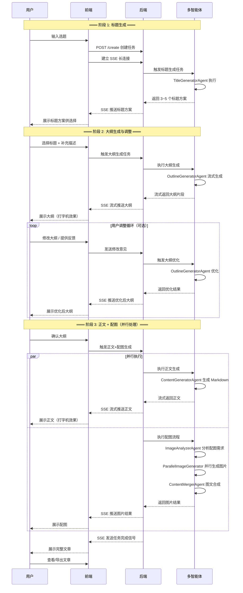
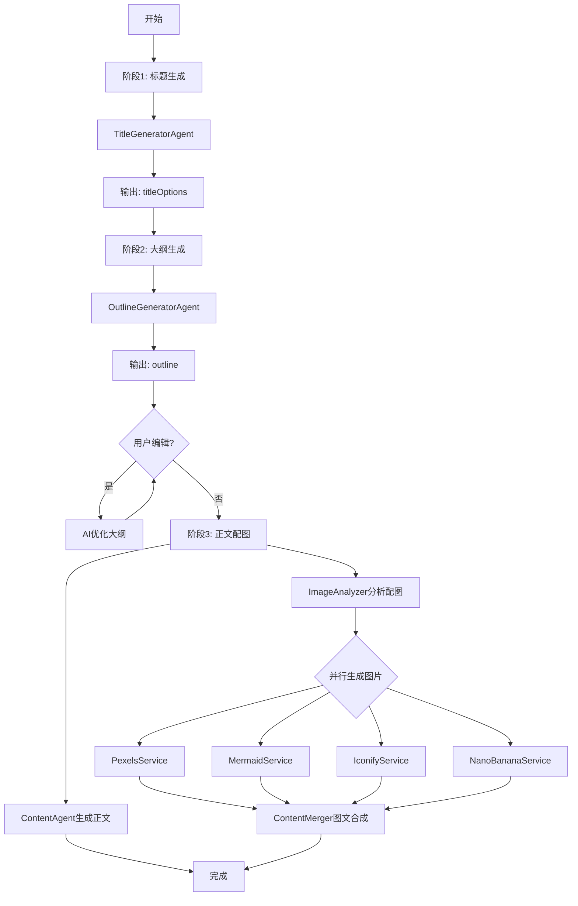
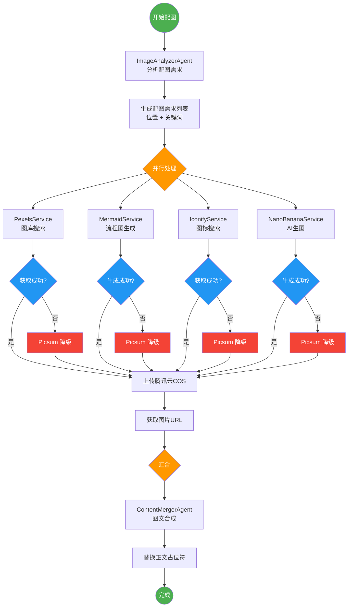

# 笔枢（写作） - 完整项目文档

---

## 项目概述

### 版本规划

| 版本 | 定位 | 核心场景 | 状态 |
|------|------|----------|------|
| **v1.0** | 新媒体文案生成 | 短文案（公众号、小红书、抖音、微博等） | 🚀 开发中 |
| v2.0 | 长文本创作 | 小说、剧本、长文章、书籍章节 | 📋 规划中 |

### v1.0 核心定位

**目标用户：** 自媒体运营、内容创作者、营销人员

**核心能力：**
- 短文案生成（标题、正文、结尾）
- 多平台适配（公众号、小红书、抖音、微博等）
- 文案风格调整（正式、活泼、种草、干货等）
- AI 辅助优化（润色、扩写、缩写）

**设计原则：**
- 优化短文本生成体验
- 快速迭代、快速出稿
- 模板化 + AI 灵活生成

> **说明：** 本文档描述的是系统完整架构设计。v1.0 版本将聚焦于短文案生成场景，长文本相关功能（如小说创作、章节管理等）将在后续版本中实现。

---

## 目录

- [1. 技术架构](#1-技术架构)
- [2. 模块划分](#2-模块划分)
- [3. 业务流程](#3-业务流程)
- [4. 三阶段创作流程](#4-三阶段创作流程)
- [5. 架构图](#5-架构图)
- [6. 流程图](#6-流程图)

---

## 1. 技术架构

### 1.1 客户端层

- 浏览器：Chrome、Edge、Safari

### 1.2 前端层

- 核心框架/工具：Vue 3.5 + TypeScript 5.8、Vite 7.0、Ant Design Vue 4.2、Pinia 3.0、Axios
- 功能组件：`markdown-it`（Markdown 渲染）、`highlight.js`（代码高亮）
- 通信方式：EventSource (SSE)

### 1.3 网关层（Nginx）

- 静态资源服务
- 反向代理
- 负载均衡

### 1.4 后端层（Spring Boot 3.5 + Java 21）

**框架技术：** MyBatis-Flex 1.11、SseEmitter (SSE)、@Async + 线程池、Spring AOP

**业务服务：** UserService、ArticleService、PaymentService、ImageService

**数据访问：** UserMapper、ArticleMapper、PaymentMapper、LogMapper

### 1.5 智能体编排层（Spring AI Alibaba + StateGraph）

**智能体（Agent）：**
- TitleGeneratorAgent：标题生成·结构化输出
- OutlineGeneratorAgent：大纲生成·流式输出
- ContentGeneratorAgent：正文创作·Markdown
- ImageAnalyzerAgent：配图需求分析
- ParallelImageGenerator：并行配图生成
- ContentMergerAgent：图文合成

**大模型调用：** DashScope (通义千问)、Stream / Structured Output

### 1.6 配图服务层（策略模式）

**策略接口：** ImageServiceStrategy

**具体实现：** PexelsService、MermaidService、IconifyService、EmojiPackService、SvgDiagramService、NanoBananaService、Picsum (降级)

### 1.7 外部服务 / 第三方集成

**API 类：** DashScope API、Pexels API、Bing Image API、Iconify API、Stripe API、Nano Banana API

**存储/工具类：** 腾讯云 COS、Mermaid CLI

**流程类：**
- 支付 Webhook：Stripe → 后端验签 → 更新订单
- 图片上传：本地 → 腾讯云 COS → CDN

### 1.8 数据存储层

**MySQL 8.0：** user 表、article 表、payment 表、agent_log 表、image 表

**Redis 7.x：** Session 存储、用户配额缓存、分布式锁、热点数据

**腾讯云 COS：** 图片对象存储、CDN 加速、防盗链

### 1.9 Docker Compose

**容器部署：**
- MySQL 容器：数据持久化 Volume
- Redis 容器：数据持久化 AOF
- 后端容器 (Spring Boot)：OpenJDK 21 + JAR 运行
- 前端容器 (Nginx)：静态资源 + 反向代理

**Docker 网络配置：** bridge 网络模式、容器间通信、端口映射、环境变量配置、日志收集、健康检查

**运维监控：** Docker stats 监控、日志查看 `docker logs`、备份策略、容器重启策略、资源限制

### 1.9 异步任务处理架构

> **核心问题：** AI 生成一篇完整的图文文章可能需要几十秒甚至一两分钟，传统的"请求-等待-响应"模式会导致接口超时。

#### 1.9.1 三层架构设计

| 层级 | 职责 | 技术实现 |
|------|------|----------|
| **接口层** | 用户通过 HTTP 接口提交选题，快速返回 taskId | REST API + 任务 ID 生成 |
| **异步执行层** | 后台线程执行耗时的智能体链路（5 个智能体依次工作） | @Async + 线程池 |
| **推送层** | 通过 SSE 实时推送执行进度给前端 | SseEmitter |

#### 1.9.2 执行流程



#### 1.9.3 设计优势

- **接口快速响应**：用户无需等待任务完成，接口立即返回
- **实时进度反馈**：前端通过 SSE 长连接实时展示当前智能体执行状态
- **人机交互友好**：用户可以在等待过程中看到"打字机效果"，提升体验
- **资源高效利用**：异步执行不阻塞主线程，支持并发处理多个任务

---

## 2. 模块划分

### 2.1 用户模块

- **基础账户管理**：用户注册/注销、登录 (Session认证)
- **会话管理**：获取当前用户信息
- **权限控制**：基于 `@AuthCheck` 注解的鉴权机制
- **后台管理**：管理员用户管理功能

### 2.2 核心创作

- **输入处理**：接收选题与风格设定
- **多智能体协作流程**：
  - 智能体1：生成爆款标题方案
  - 智能体2：生成文章大纲 (流式输出)
  - 智能体3：撰写正文 ("打字机"效果)
  - 智能体4：分析配图需求
- **结果交付**：图文合成并通过 SSE 实时推送

### 2.3 智能体复用架构

> **核心原则：智能体是"能力"，不是"场景"。4个智能体 × N种场景模式。**

#### 2.3.1 场景枚举 (ContentTypeEnum)

| 枚举值 | 场景 | 版本 | 说明 |
|--------|------|------|------|
| `NEW_MEDIA` | 新媒体文案 | v1.0 | 公众号、小红书、抖音、微博等短文案 |
| `NOVEL` | 小说创作 | v2.0 | 短篇、中篇、长篇小说 |
| `SCRIPT` | 剧本写作 | v3.0 | 影视剧本、舞台剧等 |
| `ARTICLE` | 长文章 | v2.0 | 深度报道、长文分析 |

#### 2.3.2 智能体复用矩阵

| 智能体 | 核心能力 | 新媒体文案 | 小说创作 | 复用策略 |
|--------|----------|-----------|----------|----------|
| **TitleGenerator** | 标题生成 | 爆款标题 | 书名/章节名 | 高度复用，仅 prompt 不同 |
| **OutlineGenerator** | 大纲生成 | 短大纲 (3-5点) | 章节大纲/情节线 | 接口复用，逻辑分层 |
| **ContentGenerator** | 正文创作 | 短文案 (500-2000字) | 长文本 (分章生成) | 核心复用，长文本需扩展 |
| **ImageAnalyzer** | 配图分析 | 文章配图 | 封面/插图/场景图 | 高度复用 |

#### 2.3.3 设计模式：策略模式 + 场景配置

```java
// 1. 场景枚举
public enum ContentTypeEnum {
    NEW_MEDIA("新媒体文案"),
    NOVEL("小说创作"),
    SCRIPT("剧本写作"),
    ARTICLE("长文章");
    
    private final String description;
}

// 2. 智能体接收场景参数
public class TitleGeneratorAgent {
    public List<String> generate(CreationContext context) {
        // 根据场景选择不同的 prompt 模板
        String prompt = switch (context.getType()) {
            case NEW_MEDIA -> buildNewMediaTitlePrompt(context);
            case NOVEL -> buildNovelTitlePrompt(context);
            case SCRIPT -> buildScriptTitlePrompt(context);
            default -> buildDefaultPrompt(context);
        };
        return callLLM(prompt);
    }
}

// 3. 上下文对象（预留扩展性）
public class CreationContext {
    private String topic;
    private ContentTypeEnum type;      // v1.0: NEW_MEDIA
    private String style;
    private Map<String, Object> extra; // 预留扩展字段
}
```

#### 2.3.4 Prompt 模板管理

```
resources/
  prompts/
    title/
      new_media.txt      # v1.0 使用
      novel.txt           # v2.0 新增
    outline/
      new_media.txt
      novel.txt
    content/
      new_media.txt
      novel.txt
```

**优势：** 新增场景只需添加 prompt 文件，无需修改代码。

#### 2.3.5 版本演进路径

```
v1.0 (新媒体文案)                    v2.0 (小说创作)
    │                                    │
    ├─ TitleGenerator (复用)             ├─ TitleGenerator
    │   └─ NewMediaPrompt               │   └─ NovelPrompt (新增)
    │                                    │
    ├─ OutlineGenerator (复用)           ├─ OutlineGenerator
    │   └─ 短大纲模式                    │   └─ 章节大纲模式 (新增)
    │                                    │
    ├─ ContentGenerator (复用)           ├─ ContentGenerator
    │   └─ 单次生成模式                  │   └─ 分章生成模式 (新增)
    │                                    │
    └─ ImageAnalyzer (复用)              └─ ImageAnalyzer
        └─ 文案配图模式                      └─ 小说插图模式 (新增)
```

**设计原则：** v1.0 写好骨架（接口 + 策略模式），v2.0 只换皮（新增 prompt + 策略实现）。

### 2.4 三阶段交互

- **阶段一**：标题方案选择
- **阶段二**：用户补充描述 + 大纲确认与编辑
- **阶段三**：AI 优化大纲
- **状态管理**：基于"阶段状态流转"控制整个创作生命周期

### 2.4 多模态配图

- **图库资源**：Pexels 图库 / Iconify 图标库
- **图表生成**：Mermaid 流程图生成
- **AI 绘画**：集成 Nano Banana 进行 AI 生图
- **辅助素材**：表情包 / SVG 示意图
- **服务策略**：采用策略模式，支持降级处理 (如使用 Picsum)
- **存储上传**：统一上传至腾讯云 COS

### 2.5 智能编排

- **核心引擎**：基于 StateGraph 的核心概念实现
- **图定义**：节点与边的定义
- **数据流转**：状态传递机制
- **并发处理**：并行配图生成能力
- **上下文管理**：流处理上下文环境

### 2.6 VIP 会员

- **体系设计**：VIP 会员体系架构
- **支付集成**：Stripe 支付集成
- **安全验证**：Webhook 签名验证
- **幂等性处理**：确保支付逻辑的幂等性
- **配额管理**：差异化的配额管理策略

### 2.7 文章管理

- **列表展示**：文章列表查询 (分页)
- **CRUD操作**：文章详情查看与删除
- **渲染增强**：Markdown 渲染、代码高亮显示
- **导出功能**：支持文章内容导出

### 2.8 日志监控

- **自动记录**：通过 `@AgentExecution` 注解结合 AOP 自动记录日志
- **性能分析**：执行耗时统计
- **质量监控**：成功率分析
- **运营数据**：用户活跃度统计

---

## 3. 业务流程

### 参与方

- **用户**
- **前端**
- **后端**
- **多智能体 (Multi-Agent)**

### 阶段 1: 标题生成

1. 输入选题：用户 -> 前端：用户输入选题
2. 创建任务：前端 -> 后端：发送 `POST /create` 请求创建任务
3. 建立连接：前端 -> 后端：建立 SSE (Server-Sent Events) 长连接
4. 执行生成：后端 -> 多智能体：触发"标题生成"任务
5. 推送结果：后端 -> 前端 (SSE)：实时推送生成的标题方案

### 阶段 2: 大纲生成与调整

**2.1 初始生成**
1. 选择标题：用户 -> 前端：用户从方案中选择一个标题
2. 执行生成：前端 -> 后端 -> 多智能体：触发"大纲生成"任务
3. 流式输出：后端 -> 前端 (SSE)：以流式方式推送大纲片段

**2.2 用户调整 (可选循环)**
1. 修改大纲：用户 -> 前端：用户对生成的大纲进行修改或反馈
2. 大纲优化：前端 -> 后端 -> 多智能体：后端接收修改意见，调用智能体进行大纲优化

### 阶段 3: 正文 + 配图

1. 确认大纲：用户 -> 前端：用户确认最终大纲
2. 正文流式推送：后端 -> 前端 (SSE)：开始流式推送文章正文内容
3. 并行处理 (配图)：在正文生成的同时，系统并行处理配图任务
4. 任务完成：后端 -> 前端 (SSE)：发送"任务完成"信号
5. 查看/导出：用户 -> 前端：用户在界面上查看完整文章或进行导出操作

### 关键技术点总结

- **通信协议**：全程大量使用 **SSE (Server-Sent Events)** 实现服务端向客户端的单向实时数据推送
- **交互模式**：采用"人机回环"模式，特别是在大纲阶段，允许用户介入修改并触发二次优化
- **并发处理**：在阶段 3 中，正文生成与多张配图的生成是并行处理的，以提高整体响应速度

---

## 4. 三阶段创作流程

本系统采用 **"Human in the loop" (人在回路)** 的设计理念，将复杂的创作过程解耦为三个核心阶段，并通过统一的状态管理进行串联。（**人机协同机制，让AI负责提效、人负责兜底与决策**）

### 4.1 全局状态管理

所有阶段共享同一个上下文环境，通过 **StateGraph** 维护数据流转。

- **策略模式**：所有状态键均使用 `ReplaceStrategy`（替换策略），即新值直接覆盖旧值
- **核心状态键 (14个)**：
  - 基础信息：`taskId`, `topic` (选题), `style` (风格)
  - 标题相关：`titleOptions` (标题方案), `mainTitle` (主标题), `subTitle` (副标题)
  - 大纲相关：`outline` (大纲结构)
  - 正文与配图：`content` (原始正文), `imageReqs` (配图需求), `images` (图片结果), `fullContent` (最终完整内容)

### 4.2 阶段 1：生成标题方案

- **输入**：`topic` (选题方向)、`style` (文章风格)
- **执行流程**：`START` → **TitleGeneratorAgent** → `END`
- **输出**：`titleOptions` (3~5 个爆款标题方案供用户选择)
- **用户交互**：用户选择标题后，可补充描述以引导后续创作

### 4.3 阶段 2：生成大纲

- **输入**：`mainTitle`, `subTitle` (用户选定的标题)、`userDescription` (用户补充的描述)、`style` (风格)
- **执行流程**：`START` → **OutlineGeneratorAgent** → `END`
- **输出**：`outline` (结构化的文章大纲)
- **交互特性**：支持流式生成；用户可直接编辑大纲，或让 AI 根据修改建议优化大纲

### 4.4 阶段 3：生成正文 + 配图

- **输入**：`mainTitle`, `subTitle`, `outline`、`style`, `enabledImageMethods` (启用的配图方式)
- **执行流程 (4个节点顺序执行)**：
  1. **ContentGeneratorAgent**：根据大纲生成 Markdown 格式的正文，文中包含配图占位符
  2. **ImageAnalyzerAgent**：分析正文内容，确定需要配图的位置及搜索关键词
  3. **ParallelImageGenerator**：调用多种配图服务获取图片并上传至云存储（按图片来源分组，不同类型并行处理，同类型串行处理）
  4. **ContentMergerAgent**：将生成的图片 URL 替换掉正文中的占位符
- **最终输出**：`fullContent` (包含正文 + 已替换图片 URL 的完整 Markdown 内容)

---

## 5. 架构图

### 5.1 技术架构图



### 5.2 模块划分图



---

## 6. 流程图

### 6.1 业务流程时序图



### 6.2 三阶段状态流转图



### 6.3 配图策略流程图



---

## 附录：如何查看图表

本文件中的 Mermaid 图表可以在以下环境中渲染查看：

1. **GitHub / GitLab**：直接在 Markdown 文件中预览
2. **VS Code**：安装 `Markdown Preview Mermaid Support` 插件
3. **在线渲染器**：[Mermaid Live Editor](https://mermaid.live/)
4. **JetBrains IDE**：内置 Markdown 预览支持 Mermaid
5. **Typora**：原生支持 Mermaid 图表
